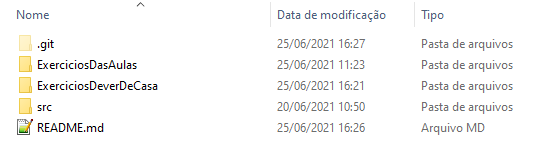
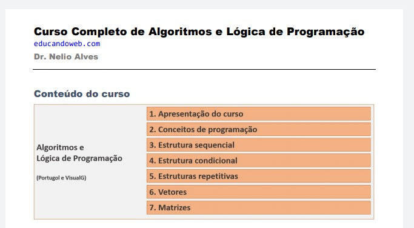

# Projeto: Algoritmos e Lógica de Programação 👨‍💻💻📑

## Descrição

>Este repositório foi criado para demostrar minha jornada e compreensão com Algoritmos e Lógica de programação. 

## Objetivos

[X] Conhecer os fundamentos dos Algoritmos e a Lógica de Programação  
[X] Compreender e aplicar a linguagem Portugol (Português Estruturado) para criação de programas que resolvam problemas  
[X] Aplicar comandos para executar solitações/pedidos ao sistema  
[X] Adquirir pensamento lógico  

## Orietações aos visitantes

>A pasta **ExerciosDasAulas** contém atividades e exemplos de exercicios oferecidos e utilizados pelo professor.    A Pasta **ExerciosDeverDeCasa** são atividades e desafios lançados pelo professor, ao qual, eu como aluno devo cumpri-los para estar apto à disciplina.

## Grade

## Recursos utilizados

* Linguagem Portugol  
* Software Visualg 3.0  
* Git (repositório local)  
* GitHub (repositório remoto)

## 🔗Referência

[- Algoritmos e Lógica de Programação 2021](https://www.udemy.com/share/102erGAkEfdllbR3w=/)